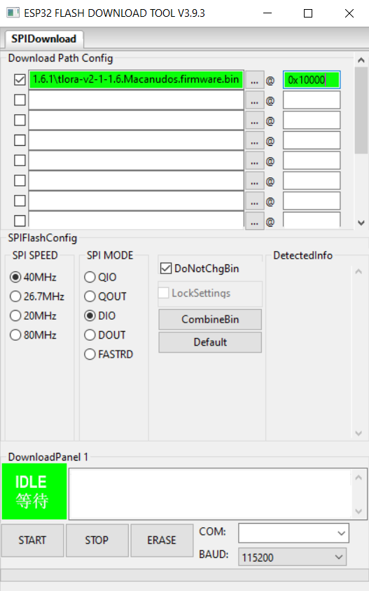
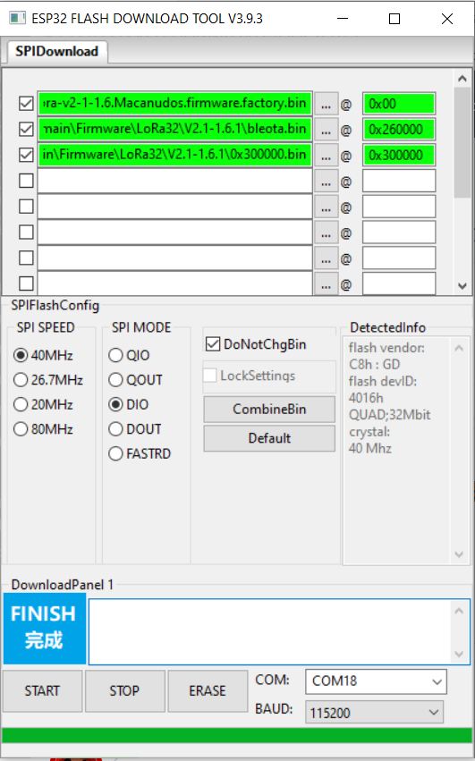

# Meshtastic Macanudos
Rede DeFLoRa

Descrição: rede de dispostivos Meshtastic LoRa de troca de mensagens, emergência e localização fora da rede. Sem qualquer dependência da internet. Comunique offgrid ou use a rede como gateway para IoT. Saber mais no site oficial: https://meshtastic.org. Existe um grupo no Facebook e uma página para a Meshtastic Portugal  assim como um grupo de Telegram Meshtastic.org Portugal para suporte e desenvolvimento públicos. 

Frequência: 433 Mhz e 868 Mhz (preferencialmente 433 Mhz) - bandas livres

Estado: Em testes com 5 routers e 3 clientes. (18.12.2022)

## Projecto DeFLoRa

Para consultar o mapas, saber ou obter informação detalhada sobre esta rede privada, mais consulte a página do projecto: https://macanudos.org/deflora

## Suporte

Online: o suporte desta rede LoRa é realizado através de um chat no servidor IRC #suporte e do mumble do Macanudos.org, canal redesuporte

Fora da rede: mas dentro da rede DEFLORA, suporte no canal suporte.

## Equipamentos
Os equipamentos fornecidos já vêm programados e configurados para a rede, com os canais extra e as prioridades máximas. Configuramos ao sabor do cliente. Todos os dispositivos são universais podendo servir qualquer outra função futura que venha a ter necessidade. Para saber mais, consulta a página DeFLoRa.

# Instalação do firmware Meshtastic Macanudos

Deve instalar o firmware usando a tool [Flash Download Tools	Windows](https://www.espressif.com/en/support/download/other-tools)

# Exemplos de configuração para modelos ESP32

## Update Firmware

## Factory Default ou Primeira instalação

# Exemplo de configuração para modelos NRF52

## Update Firmware

* Conecte seu dispositivo ao computador com um cabo de dados USB.
* Clique duas vezes no botão de reinicialização do seu dispositivo (isso o colocará no modo bootloader)
* Observe que uma nova unidade será montada em seu computador (Windows, Mac ou Linux)
* Abra esta unidade e você verá três arquivos: CURRENT.UF2, INDEX.HTM e INFO_UF2.TXT
* Solte o arquivo de firmware apropriado (Por Exemplo: T-Echo.Macanudos.firmware.uf2) da versão nesta unidade.
* Depois que o arquivo for copiado para a unidade, o dispositivo será reinicializado e instalará o firmware Meshtastic-Macanudos

# Instalação da Aplicação para smartphones 

ANDROID [Última versão Android Meshtastic APP](https://github.com/roltel/meshtastic-macanudos/raw/main/Android/Meshtastic_Android_V2.0.11.apk)

# Canais da rede DefLoRa

Existem 3 canais publicos iniciais na rede, um é o "primary" que é o canal principal da rede meshtastic, e do outros um é o canal 333 e o suporte.
Para configurar o canais da rede basta ler o QRK code aqui.
O canal #rodinha é reservado a convite e econtra-se ligado à vénus e destinado a testes.

# polish community tries solving that with transistor key and a NE555 timer

# Links

https://macanudos.org/deflora
https://macanudos.org/
https://flasher.meshtastic.org/ Flasher
https://meshtastic.org/downloads Firmware
https://meshtastic.org/docs/introduction Documentation

