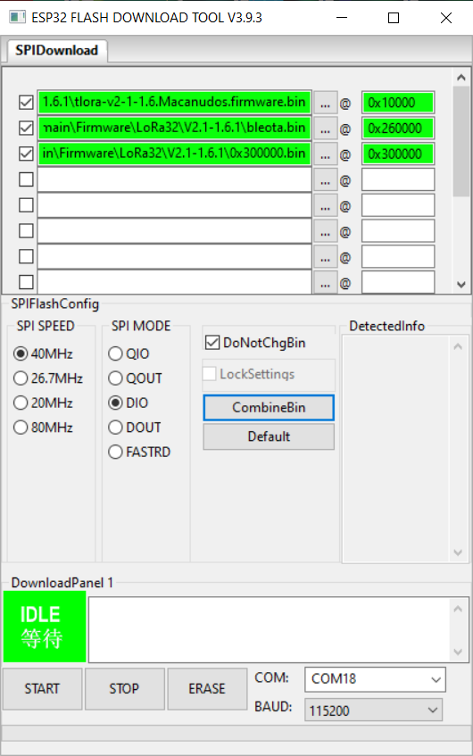

# meshtastic-macanudos
Rede deflora.

Codename: DefLoRa

Descrição: rede de dispostivos LoRa de troca de mensagens, emergência e localização fora da rede. Sem qualquer dependência da internet. Comunique offgrid ou use a rede como gateway para IoT.

Frequência: 868 Mhz e 433 Mhz (preferencialmente 433 Mhz) - bandas livres

Estado: Em testes com 5 routers e 3 clientes. (18.12.2022)

Cobertura: Estes equipamentos dependem de linha de vista para conseguir bons resultados. Daí que é expectável que os utilizadores tenham dois rádios destes. Um no telhado de casa, totalmente autónomo, sem necessidade de fio, com mini painel solar. E um segundo dispositivo que é o cliente que envia as mensagens para o router no telhado e que faz chegar a mensagem ao destinatário.

Dispositivos: Embora existam mais, os Macanudos usam um de três dispositivos: (A) LILYGO® TTGO  T Echo, (B) LILYGO® TTGO T-Beam e o (C) LILYGO TTGO LORA32, preferencialmente nos 433Mhz. O T-Echo custa cerca de 80 euros, podendo ter um um custo superior caso escolha a opção com sensor de temperatura e pressão atmosférica, além do GPS de origem. O LILYGO® TTGO T-Beam custa cerca de 50 euros e é o dispositivo mais comum, com WIFI e GPS. A este acrescem uma pilha específica de longa duração e no segundo uma caixa para não andar com o T-Beam sujeito aos elementos. Por fim o dispotivo mais barato, sem GPS é o LILYGO TTGO LORA32 que custa cerca de 30 euros, vem sem GPS embora dê para ligar um externo e, não vem com suporte de bateria.

Router: É um roteador de mensagem pela rede. Recebe e reenvia as mensagens criando uma rede que faz chegar os pacotes ao destino. O NOVELO é o equipamento critico para a construção e manutenção desta rede deflora. Os membros contribuem na sua implementação e suporte de duas formas: primeiro, comprando e colocando um novelo no telhado de sua casa, e segundo contribuindo com a taxa de subscrição à rede acima referida, num mínimo de 50 euros. Os novelos terão como nome o código de freguesia ICOFE.

Pacote gratuito: Subscrição à rede, com comunicação de mensagens ou IoT em qualquer das bandas (433 ou 868 Mhz), acesso ao canais públicos e à rede de emergência. Limite de mensagens. Sem suporte.

Financiamento: A rede assenta nos NOVELOS colocados nos locais estratégicos, e que têm um custo aproximados de 75 euros. Torna-se membro da rede "deflora", quem contribuir com 50 euros ou mais para a rede. Esta qualidade é vitalícia e de serve para custear um novelo.

## Suporte

Online: o suporte desta rede LoRa é realizado através de um chat no servidor IRC #redesuporte e do mumble do Macanudos.org, canal redesuporte *. Deve ter consigo o cartão de membro para suporte urgente.
Fora da rede: mas dentro da rede DEFLORA, suporte no canal redesuporte.*

Emergência: Não é finalidade desta rede servir pedidos de socorro, no entanto em caso de falha das comunicações, além do promovido plano 333, a rede deflora tem um canal "333" ao dispor, a funcionar independente de qualquer internet, satélite ou cabo. Ou seja o plano 333 aplica-se ao canal "333" dentro da rede (saber mais).

Os equipamentos fornecidos já vêm programados e configurados para a rede, com os canais extra e as prioridades máximas. Configuramos ao sabor do cliente. Todos os dispositivos são universais podendo servir qualquer outra função futura que venha a ter necessidade.

* Este canal não é de emergência. Para emergência deve usar os meios tradicionais primeiro, e de seguida CB no canal 3 ou 9 e o 333 dentro da rede Meshtastic Macanudos/DEFLORA.

# Instalação

Deve instalar o firmware usando a tool [Flash Download Tools	Windows](https://www.espressif.com/en/support/download/other-tools)

Exemplos de configuração

Existem 3 canais publicos iniciais na rede, um é o "primary" que é o canal principal da rede meshtastic, e o outros é o canal 333 e o redesuporte.
Para configurar o canais da rede basta ler o QRK code aqui.
O canal #rodinha é reservado a convite e econtra-se ligado à vénus e destinado a testes.

